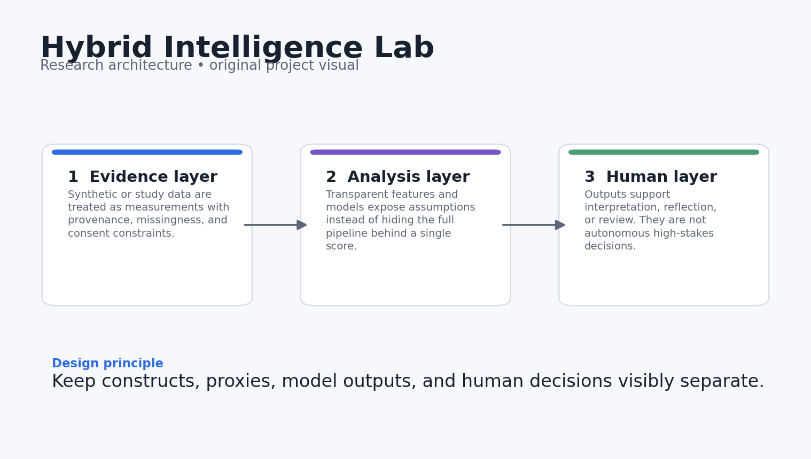
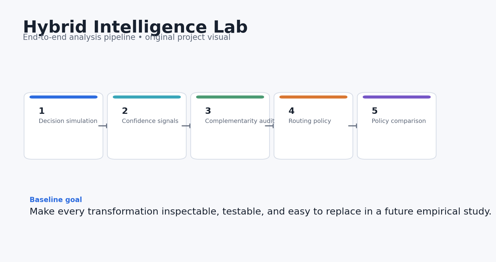
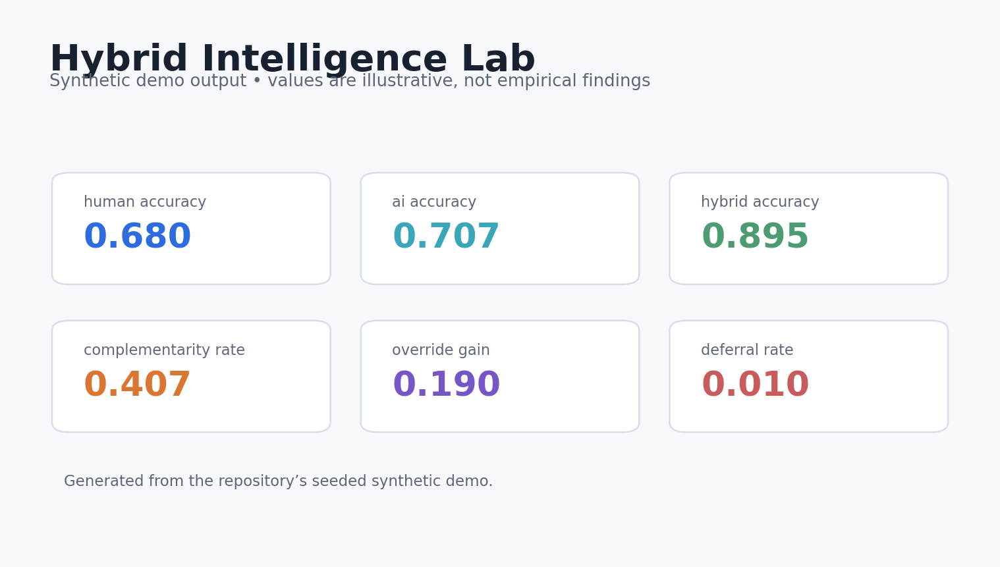
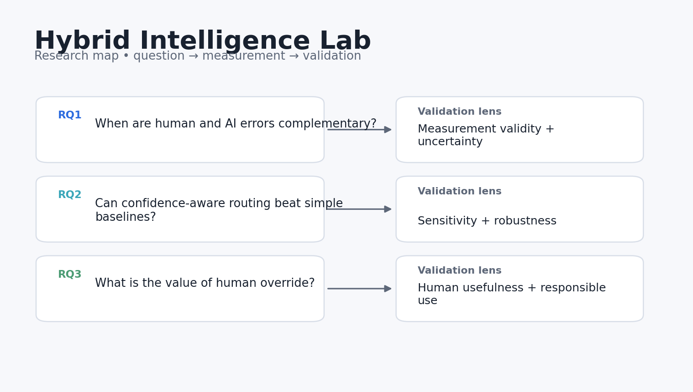

# Hybrid Intelligence Lab

[](https://github.com/devissaputra/hybrid_intelligence_lab/actions/workflows/ci.yml)


**Category:** AI in Education
**An experimental harness for studying when humans and AI should decide alone, together, or defer.**

> Research prototype. All bundled data and results are synthetic demonstrations. Nothing in this repository should be interpreted as evidence about real learners, teachers, or institutions.



## Why this project exists

AI-assisted learning decisions are often evaluated by comparing “human” against “model.” This repo makes the more interesting question executable: when do their errors complement one another, and what routing policies preserve human agency while using AI where it adds value?

The simulator separates human performance, AI confidence, disagreement, deferral, and override so routing gains can be traced to specific cases instead of disappearing inside one aggregate score.

## Research questions

1. When are human and AI errors complementary rather than redundant?
2. Can confidence-aware routing outperform always-human or always-AI baselines?
3. How much value comes from human override when the two disagree?

## What the repository does



The reference pipeline follows five stages:

1. **Decision simulation**
2. **Confidence-signal comparison**
3. **Complementarity analysis**
4. **Routing policy**
5. **Policy comparison**

The baseline is intentionally transparent so alternative routing policies and cost assumptions can be tested before any real decision-support study.

## Core outputs

- `human_accuracy`
- `ai_accuracy`
- `hybrid_accuracy`
- `complementarity_rate`
- `override_gain`
- `deferral_rate`



The dashboard above is generated from **synthetic data** and is included only to show what the analysis surface looks like. It is not a reported empirical result.

## Quick start

```bash
python -m venv .venv
source .venv/bin/activate  # Windows: .venv\Scripts\activate
pip install -e .[dev]
python examples/demo.py
pytest -q
```

You can also use Docker:

```bash
docker build -t hybrid_intelligence_lab .
docker run --rm hybrid_intelligence_lab
```

## Repository structure

```text
hybrid_intelligence_lab/
├── src/hybrid_intelligence_lab/        # core implementation and synthetic-data generator
├── examples/demo.py        # end-to-end reproducible demo
├── tests/                  # executable unit tests
├── docs/                   # research design, data dictionary, references
│   └── images/             # original project diagrams and demo visualisations
├── results/                # synthetic demo outputs only
├── config/default.yaml
├── Dockerfile
├── Makefile
└── pyproject.toml
```

## Research design in one picture



The fuller design rationale is in [`docs/research_design.md`](docs/research_design.md), including constructs, assumptions, validation steps, and a proposed empirical extension.

## Reproducibility choices

- Synthetic generation uses a fixed random seed.
- The core metrics are implemented as small, testable functions.
- The demo writes machine-readable results into `results/`.
- CI runs the tests on every push and pull request.
- No API keys, proprietary datasets, or external model calls are required for the baseline.

## Responsible-use boundaries

- The simulator is a research harness, not evidence that one routing policy is optimal in classrooms.
- Confidence values are synthetic and should be calibrated in real deployments.
- Human defaulting is modeled as a policy choice, not as a claim that human judgment is always superior.

## Strong next experiments

- Add cost-sensitive routing and abstention.
- Model expertise-dependent human performance and calibrated AI confidence.
- Run counterbalanced user studies comparing different forms of AI advice and override control.

## References

See [`docs/references.md`](docs/references.md). The references are there to locate the project in current AIED, learning-analytics, human-centered AI, and instructional-design research. They do **not** imply endorsement or affiliation.

## Citation

If you build on this research prototype, use the metadata in [`CITATION.cff`](CITATION.cff).

## License

MIT for the code in this repository. Research data from future studies should use a separate data-governance and consent process.
